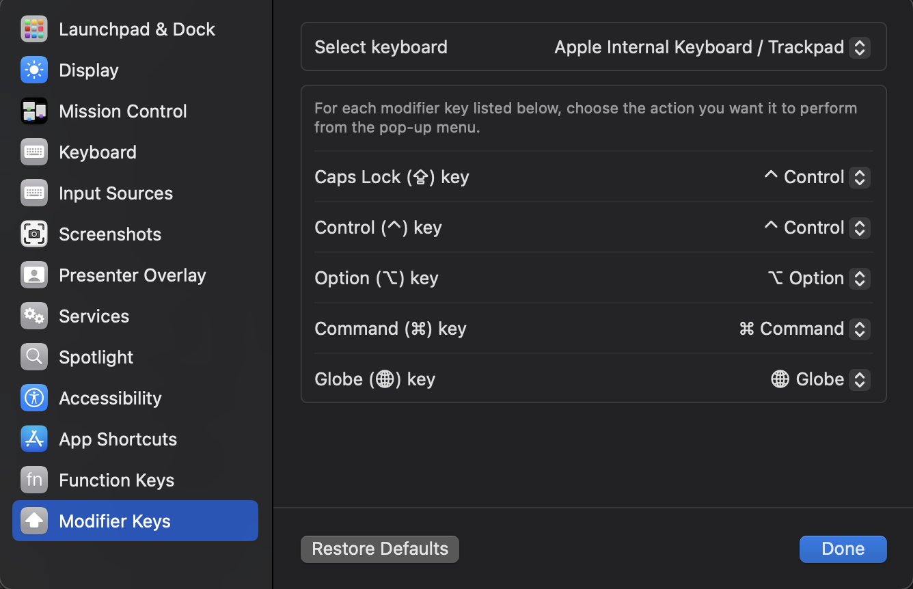
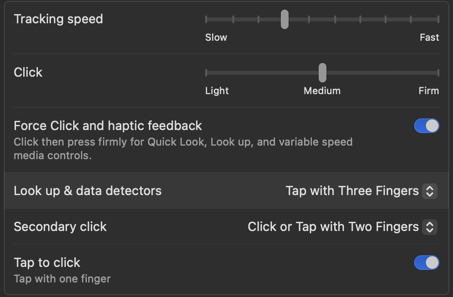
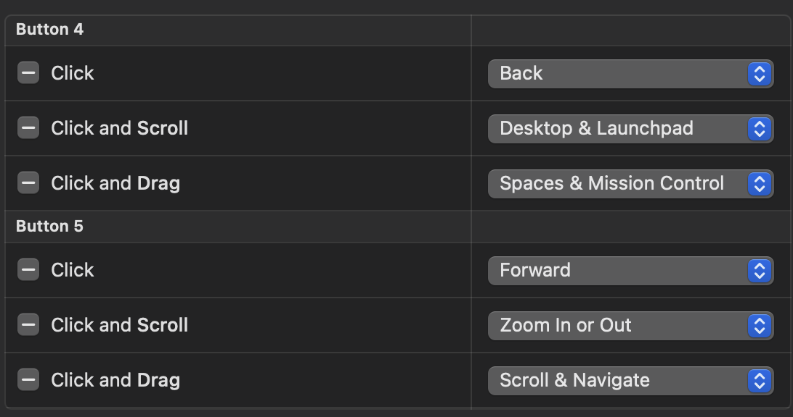

- [x] Setup Wezterm
  - [x] stow wezterm config
- [ ] Install Homebrew
  - [ ] Create a Brewfile and use that to install all of binaries to the OS
  - [ ] Install NeoVim and LazyVim
    - [ ] Stow neovim config
  - [ ] Starship - Prompt
  - [ ] NeoVim - Code Editor
  - [ ] Zoxide - Navigating Multiplexer Workspace
  - [ ] eza - LS Replacement
  - [ ] fzf - fuzzy finding anything on machine
  - [ ] ripgrep - better grep
  - [ ] lazygit - cli git manager
  - [ ] htop - process monitoring
  - [ ] bat - cat replacement and pager

## Misc

Modifier key `caplocks` to `ctrl`



- [ ] Install dashlane - access to all accounts
- [ ] Remove delay dock

```bash
defaults write com.apple.dock "autohide-delay" -float "0" && killall Dock
```

- [ ] Sync to iCloud
- [ ] Install Obsidian
- [ ] Install fonts
  - [ ] OperatorMonoLig Nerd Font
  - [ ] JetBrainsMono Nerd Font
- [ ] Install raycast
  - [ ] set raycast shortcut to `cmp` + `space` (replace **Splotlight** macos)
- [ ] Install betterdisplay
  - [ ] resize external monitor to full hd
- [ ] Install xcode-select (Apple Developer Kit - Need to install homebrew)
- [ ] Sign in to Github
  - [ ] create new ssh key (can restore from dashlane note)
- [ ] Trackpad setting



- [ ] Install MacMouseFix



- [ ] Finder settings
